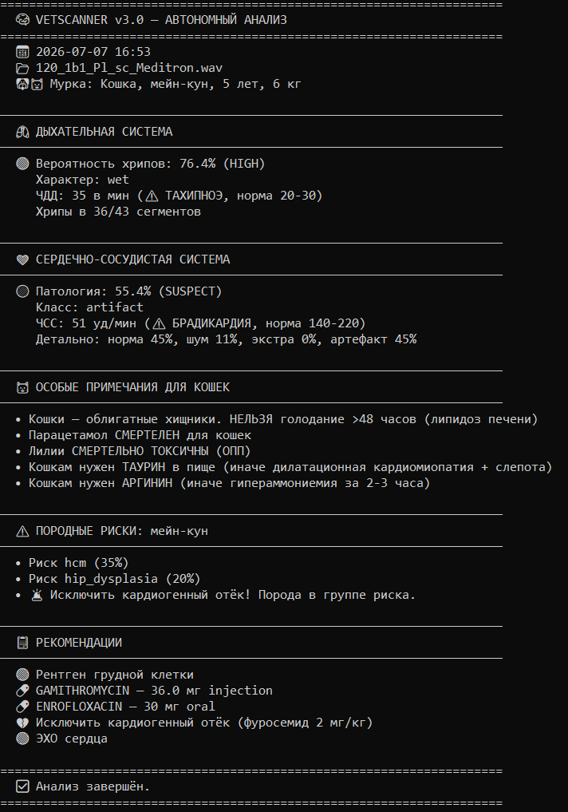

# AI VetScan — Ветеринарный AI-диагностический комплекс

## О проекте

AI VetScan — прототип интеллектуальной системы поддержки врачебных решений (CDSS) для ускоренного скрининга патологий дыхательной и сердечно-сосудистой систем у собак и кошек.

Проект объединяет анализ медицинских данных, машинное обучение и базу ветеринарных знаний для помощи специалистам в предварительной оценке состояния животных.

## Цель проекта

Основная цель — исследовать возможности применения AI для:
- анализа звуков дыхания и сердца;
- выявления возможных патологий;
- структурирования ветеринарных данных;
- поддержки принятия диагностических решений.

## Моя роль

Автор и разработчик проекта.

В рамках проекта:
- исследовала предметную область;
- собирала и структурировала датасеты;
- подготавливала и проверяла данные;
- разрабатывала ML-модели;
- тестировала результаты моделей;
- организовывала структуру проекта и документацию.

---

# Возможности системы

## 🫁 PulmoScan

Анализ аудиозаписей дыхания:
- выявление хрипов (сухие/влажные/смешанные);
- оценка частоты дыхания;
- предварительная локализация возможных нарушений.

## ❤️ CardioFlow

Анализ сердечных звуков:
- классификация состояния:
  - норма;
  - шумы;
  - экстрасистолы;
  - артефакты.

## 💊 PharmaDSS

База ветеринарных препаратов:
- 323 препарата;
- расчёт дозировки по виду животного и весу;
- проверка лекарственной информации.

## 🧠 VetKnowledge

База ветеринарных знаний:
- 75 пород собак;
- 23 породы кошек;
- генетические риски;
- референсные значения;
- информация о лекарственной токсичности.

## 🔍 DataHunter

Инструмент подготовки данных:
- автоматический поиск датасетов;
- работа с Kaggle CLI;
- мониторинг файловой системы.

## 🐹 DataMole

Подготовка аудиоданных:
- сортировка;
- проверка качества;
- подготовка файлов для обучения моделей.

---

# Результаты моделей

| Модель | Данные | Точность |
|---|---|---|
| PulmoNet v2 | ICBHI 2017 (920 записей) | 80.6% |
| CardioNet Vet | PhysioNet + PASCAL + Kaggle Heartbeat (4000+ записей) | 85.8% |
| CHF Risk Scorer | Heart Failure Clinical Records (299 пациентов) | 83.3% |

---

# Демонстрация



---

# Быстрый запуск

```bash
git clone https://github.com/vdrebezgi/AI-vet_scan.git

cd AI-vet_scan

pip install tensorflow scipy scikit-learn matplotlib joblib

python vet_station.py
```

# Структура проекта
```text
pilot-pulmoscan/

├── vet_station.py              # Главный файл запуска системы
├── vet_scanner_v3.py           # Основной анализатор
├── pulmoscan_pro.py            # Анализ дыхательных данных
├── vet_knowledge_v2.py         # База ветеринарных знаний
├── pharma_hunter.py            # Работа с лекарственной базой
├── data_hunter.py              # Сборщик датасетов
├── data_mole.py                # Подготовка аудиоданных
├── vet_knowledge_base.json     # База знаний
├── pharma_base_enriched.json   # База препаратов
└── case_3d.step                # 3D-модель корпуса
```

# Технологический стек 
```text
Python
TensorFlow / Keras
Scikit-learn
SciPy
Matplotlib
Kaggle API
PubMed API
```

# Текущий статус

Проект находится в активной разработке.
Планируется развитие автономной версии устройства на базе ESP32.
